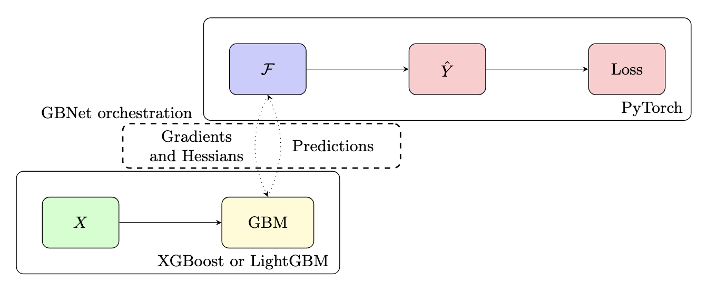

# GBNet
[](https://doi.org/10.21105/joss.08047)
[](https://pepy.tech/projects/gbnet)

PyTorch modules for XGBoost and LightGBM.

[**Link to Forecast App**](https://mthorrell.github.io/gbnet/web/app/)



---

## What is GBNet?

Gradient boosting libraries like XGBoost and LightGBM are excellent for tabular data, but can be cumbersome to extend with custom losses or architectures because you must supply gradients and Hessians by hand.

GBNet wraps these libraries in PyTorch modules so you can:

- Define losses and architectures in plain PyTorch
- Let PyTorch autograd compute gradients / Hessians
- Use XGBoost / LightGBM / boosted linear layers as building blocks inside larger models

At the core are three PyTorch Modules:

- `gbnet.xgbmodule.XGBModule` – XGBoost as a PyTorch Module
- `gbnet.lgbmodule.LGBModule` – LightGBM as a PyTorch Module
- `gbnet.gblinear.GBLinear` – a linear layer PyTorch Module trained with boosting instead of SGD

On top of these, GBNet ships higher-level models in `gbnet.models`, including forecasting, ordinal regression and survival models.

---

## Installation

GBNet is on PyPI:

```bash
pip install gbnet
```

Using a virtual environment or conda environment is recommended. If you run into build / wheel issues for these dependencies, install them first following their platform-specific instructions, then install `gbnet`.

---

## Quick Start: XGBoost as a PyTorch Module

Basic pattern: treat `XGBModule` as a PyTorch `nn.Module`, use any PyTorch loss, and call `gb_step()` to advance the boosted model.

```python
import numpy as np
import torch
import xgboost as xgb

from gbnet import xgbmodule

# Toy regression data
np.random.seed(0)
n = 1000
input_dim = 20
output_dim = 1
X = np.random.random([n, input_dim])
B = np.random.random([input_dim, output_dim])
Y = X.dot(B) + 0.1 * np.random.randn(n, output_dim)

# XGBModule is a PyTorch Module wrapping XGBoost
model = xgbmodule.XGBModule(
    batch_size=n,
    input_dim=input_dim,
    output_dim=output_dim,
    params={}
)
loss_fn = torch.nn.MSELoss()

X_dmatrix = xgb.DMatrix(X)

losses = []
for _ in range(100):
    model.train()
    model.zero_grad()

    preds = model(X_dmatrix)
    loss = loss_fn(preds, torch.tensor(Y, dtype=torch.float32))
    loss.backward(create_graph=True)  # create_graph=True is required for gbnet
    losses.append(loss.item())

    model.gb_step()

model.eval()
preds = model(X_dmatrix)  # standard PyTorch-style inference
losses                    # decrease to near zero
```

Key ideas:

- Training data must stay fixed while training (no changing the dataset between iterations). In this way, model training is closer to GBM training rather than Neural Network training.
- Gradients / Hessians are extracted from the PyTorch graph; no need to implement them manually.
- `gb_step()` is the “one more boosting round” operation.

The `LGBModule` interface is analogous but uses LightGBM under the hood.

---

## Built-In Models

GBNet includes higher-level models built on these Modules. These live in `gbnet.models` and follow a scikit-learn-style `fit`/`predict` API.

### Forecasting

`gbnet.models.forecasting.Forecast` provides a time-series model with trend + seasonality + changepoints using GBNet components. It is designed to be competitive with Prophet-style workflows while remaining flexible.

Minimal usage:

```python
import pandas as pd
from gbnet.models import forecasting

# df has columns: 'ds' (datetime), 'y' (target)
df = pd.read_csv("your_timeseries.csv")
df["ds"] = pd.to_datetime(df["ds"])

model = forecasting.Forecast()
model.fit(df, df["y"])

forecast_df = model.predict(df)
print(forecast_df.head())
```

See `examples/simple_forecast_example.ipynb` and the web demo under `web/` for more complete forecasting examples.

### Ordinal Regression

`GBOrd` in `gbnet.models.ordinal_regression` implements ordinal regression using GBMs with a PyTorch-defined loss.

- Example notebook: `examples/ordinal_regression_comparison.ipynb`

### Survival Models

GBNet includes survival analysis models under `gbnet.models.survival`, such as:

- `HazardSurvivalModel` – continuous-time hazard model with a gradient-boosted hazard backbone
- `BetaSurvivalModel` – discrete-time survival using Beta distributions with boosting
- `ThetaSurvivalModel` – discrete-time survival via a geometric distribution parameterized by a GBM

Example notebooks:

- `examples/hazard_survival_example.ipynb`
- `examples/discrete_survival_examples.ipynb`

---

## Project Layout and Resources

- `gbnet/` – core library:
  - `xgbmodule.py`, `lgbmodule.py`, `gblinear.py`
  - `models/` – forecasting, ordinal regression, survival, more to come
- `examples/` – Jupyter notebooks:
  - `simple_forecast_example.ipynb`
  - `gblinear_forecast_example.ipynb`
  - `ordinal_regression_comparison.ipynb`
  - `hazard_survival_example.ipynb`
  - `discrete_survival_examples.ipynb`
- `web/` – browser-only forecasting app (served via GitHub Pages)
- `docs/` – docs site

Start with the quick-start code above, then open the notebooks in `examples/` to see end-to-end workflows.

---

## Contributing

Contributions and issues are welcome. Typical ways to help:

- Report bugs or performance issues
- Propose or implement new models built on GBNet modules
- Improve docs, notebooks, or examples

Before opening a pull request:

1. Add or update tests for any new functionality.
2. Run the existing test suite (e.g. `pytest`) if available in your environment.
3. Keep code style consistent with the existing modules.

For larger changes, it’s helpful to open an issue first to discuss design.

---

## Citation

If you use GBNet in academic work, please cite:

```text
Horrell, M., (2025). GBNet: Gradient Boosting packages integrated into PyTorch.
Journal of Open Source Software, 10(111), 8047, https://doi.org/10.21105/joss.08047
```

