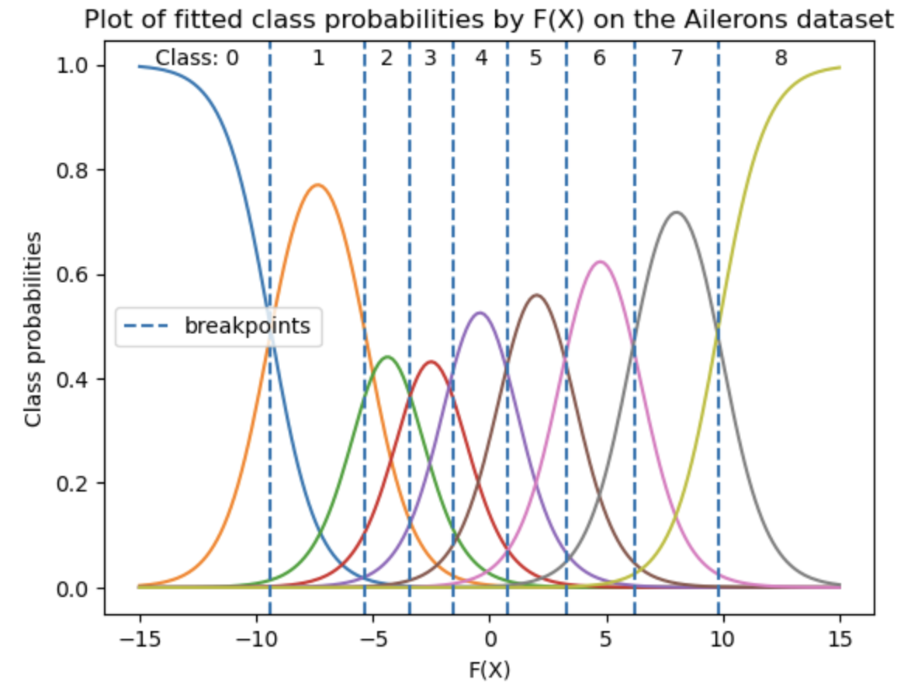

# Summary

GBNet is a Python software package that integrates the powerful Gradient Boosting Machines (GBMs) [@friedman2001gbm] packages XGBoost [@chen2016xgboost] and LightGBM [@ke2017lightgbm] with PyTorch [@paszke2019pytorch], a widely-used deep learning library. Gradient boosting is a popular machine learning technique known for its accuracy in predictive modeling. XGBoost and LightGBM are industry-standard implementations of GBMs recognized for their speed and strong performance across numerous applications [@kaggle2021survey]. However, these libraries primarily handle standard machine learning tasks and present challenges when applied to complex or non-standard modeling scenarios. For example, using non-standard loss functions with either XGBoost or LightGBM requires manual computation of gradients and Hessians, a prohibitively difficult requirement for even moderately complex losses.

PyTorch is popular for its ease of defining and training neural networks. Its computational graph provides automatic differentiation capabilities. GBNet leverages these capabilities, linking gradient and Hessian calculations from PyTorch to XGBoost or LightGBM models. This integration allows users to construct and train complex hybrid models that combine gradient boosting with neural network architectures. GBNet significantly broadens the scope of problems that can be solved with the world-leading gradient boosting software packages.

# Statement of need

While XGBoost and LightGBM are industry-standard solutions for tabular data machine learning problems, they offer limited flexibility in defining complex model architectures tailored to specific problem types. Users wishing to define custom loss functions, novel architectures, or other advanced modeling scenarios face substantial difficulty due to the complex gradient and Hessian calculations required by both XGBoost and LightGBM.

As a simple motivating example, consider a forecasting model that combines a linear trend with a periodic component. A natural specification of this model might be:

$$\text{Forecast}(t) = t\beta + \text{PeriodicFn}(t)$$

where $\beta$ is a constant defining the trend and $\text{PeriodicFn}$ is modeled using a GBM. Despite its relative simplicity, this model cannot be easily fit using XGBoost or LightGBM alone.

GBNet addresses this limitation by providing PyTorch Modules that wrap XGBoost and LightGBM. These Modules serve as model building blocks like any other PyTorch Module. Valid code defining a PyTorch module implementing the above forecast model is given in just a few lines:

```python
import torch
from gbnet.xgbmodule import XGBModule

class ForecastModule(torch.nn.Module):
    def __init__(self, n, d):
        super().__init__()
        self.linear = torch.nn.Linear(d, 1)
        self.xgb = XGBModule(n, d, 1)

    def forward(self, t):
        return self.linear(t) + self.xgb(t)

    def gb_step(self):
        self.xgb.gb_step()
```

The key components of this code are `XGBModule`, the wrapper for XGBoost, and `gb_step()`, a method that updates the underlying XGBoost model. The `gb_step()` method is called after each forward pass to update the gradient boosting model, while PyTorch's autograd system handles the updates for the linear component.

As demonstrated in this example, once an instance of `XGBModule` is defined, it can be combined with any other model logic supported by PyTorch. This straightforward example illustrates GBNet's ease-of-use in defining complex models.

GBNet is the first software package to combine state-of-the-art gradient boosting software with neural network packages in a near-seamless and general way. Other packages either solve similar problems by providing Gradient Boosting packages with slightly more complex capabilities [@DBLP:journals/corr/abs-2007-09855;@ordinalgbt] or, when combining GBMs and Neural Networks, resort to different types of stacking or other more complex combinations [@dndf:2015;@deepgbm:2019;@ndt:2017;@node:2019]. GBNet allows users of the world's best gradient boosting packages to explore many of the rich architectural possibilities available through PyTorch.

## Research Applications

Several research areas stand to benefit from GBNet. The package includes a forecasting application (`gbnet.models.forecasting`) that demonstrates improved performance over Meta's Prophet algorithm [@taylor2018prophet] on a set of benchmarks, as shown in the notebook linked [here](https://github.com/mthorrell/gbnet/blob/main/examples/simple_forecast_example.ipynb). The package also provides an ordinal regression implementation (`gbnet.models.ordinal_regression`) featuring the ordinal loss, which is complex, has fittable parameters, and is not included in either XGBoost or LightGBM. A notebook [here](https://github.com/mthorrell/gbnet/blob/main/examples/ordinal_regression_comparison.ipynb) demonstrates the ordinal regression application.

More broadly, GBNet may benefit any researcher looking to leverage non-parametric methods while maintaining structural control over their model. In particular, researchers using PyTorch primarily for its ability to produce outputs suited for their application may prefer GBNet at times because XGBoost and LightGBM are robust estimators. Neural networks can be finicky, requiring many small adjustments and normalizations, while GBMs often work reliably with minimal tuning.

Research into network architectures specifically tailored for GBMs may also hold intrinsic value. Several classic architectures previously explored exclusively with pure neural network methods are now accessible for GBMs through GBNet. Important concepts and methods such as embeddings [@mikolov2013distributed], autoencoders [@hinton1993autoencoders], variational methods [@kingma2013auto], and contrastive learning [@hadsell2006dimensionality] may exhibit novel and interesting properties when integrated with GBMs.

# Software Description and Examples

GBNet comprises two primary sets of submodules:

- `gbnet.xgbmodule`, `gbnet.lgbmodule`, `gbnet.gblinear`: Contain PyTorch Module classes (`XGBModule`, `LGBModule` and `GBLinear`) that integrate XGBoost, LightGBM and a linear booster respectively.
- `gbnet.models`: Includes practical implementations of models using either `XGBModule` or `LGBModule`. Currently there are two implementations. `gbnet.models.forecasting` provides a Sci-kit Learn interface [@scikit-learn] for an optimized version of the forecast model shown above. `gbnet.models.ordinal_regression` provides a Sci-kit Learn interface for Ordinal Regression.

## Forecasting Example

`gbnet.models.forecasting.Forecast` is compared to the Meta Prophet algorithm over 500 independent trials as reported in the following table. Each trial consists of selecting a dataset uniformly at random, selecting a training cutoff uniformly at random, selecting a test period cutoff uniformly at random, and finally training a model and testing performance. The default `gbnet.models.forecasting.Forecast` beats Prophet in 74% of trials and has a higher than 50% win rate on 8 out of 9 datasets when comparing RMSE values. In addition, `gbnet.models.forecasting.Forecast`, when it has the losing RMSE, tends to lose by less in comparison to Prophet.

| Dataset                   | N trials | GBNet win Rate (%) | Avg. GBNet Losing RMSE Ratio | Avg. Prophet Losing RMSE Ratio |
|---------------------------|----------|--------------------|------------------------------|--------------------------------|
| Air Passengers            | 50       | **74%**            | **1.42**                         | 1.64                           |
| Pedestrians Covid         | 56       | **66%**            | **1.21**                         | 1.73                           |
| Pedestrians Multivariate  | 54       | **70%**            | **1.34**                         | 1.35                           |
| Retail Sales              | 75       | **81%**            | **1.26**                         | 1.97                           |
| WP Log R                  | 59       | **90%**            | **2.19**                         | 2.60                           |
| WP Log R Outliers1        | 60       | **77%**            | **1.40**                         | 2.56                           |
| WP Log R Outliers2        | 49       | **71%**            | **1.85**                         | 2.47                           |
| WP Log Peyton Manning     | 45       | 44%                | **1.36**                         | 2.22                           |
| Yosemite Temps            | 52       | **85%**            | **2.16**                         | 2.93                           |

Code for these results is [here](https://github.com/mthorrell/gbnet/blob/main/examples/simple_forecast_example.ipynb).

## Ordinal Regression Example

Ordinal regression fits a model with a 1-dimensional output, $F(X) \in \mathbb{R}$, that is thresholded at different points to achieve an ordinal classification. McCullagh @mccullagh1980regression introduces a cumulative logit model with thresholds to define a consistent statistical model for ordinal regression. `gbnet.models.ordinal_regression.GBOrd` implements the cumulative logit model. Specifically `GBOrd` fits threshold parameters $\theta_i \in \mathbb{R}$ and a GBM, $F(X)$, to optimize the likelihood defined by

$$ P(y <= i | X) = \sigma(\theta_i - F(X)). $$

Fitting this ordinal regression model using GBMs without a tool like GBNet is complex: (1) neither XGBoost nor LightGBM offer this objective; (2) calculating the negative log-likelihood (that is, its loss) has multiple steps&mdash;a cumulative distribution function is calculated and then differenced to find the likelihood; (3) the objective has parameters, $\theta_i$, that need to be fit along with $F(X)$. 

`GBOrd` leverages `XGBModule` and `LGBModule` and native PyTorch functionality to make fitting an ordinal regression model straightforward using either XGBoost or LightGBM back-ends. As an illustration, a plot showing the fitted probabilities on the Ailerons dataset from [@gagolewski_ordinal_regression] is below. The breakpoint parameters are fit via gradient descent simultaneously with the GBM. The uneven spacing of the breakpoints in the figure demonstrates that the model has learned a more optimal separation between classes rather than using evenly spaced breakpoints.



A reproducible benchmark comparing `GBOrd` to alternative approaches across several data sets is provided [here](https://github.com/mthorrell/gbnet/blob/main/examples/ordinal_regression_comparison.ipynb).

# Acknowledgements

The author gratefully acknowledges insightful feedback from Joe Guinness.

# References
